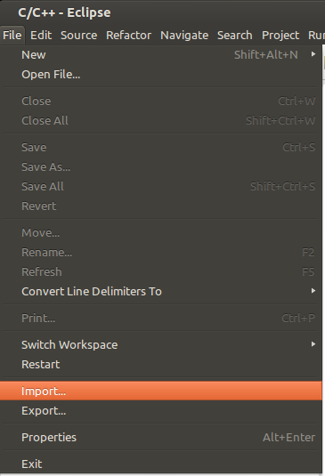
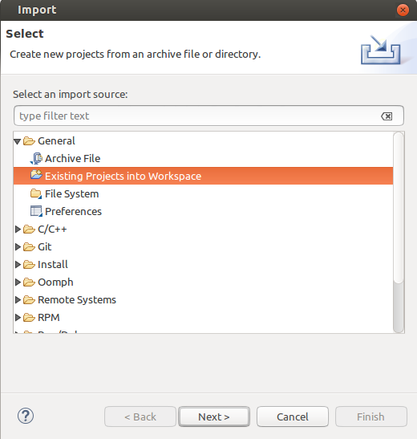
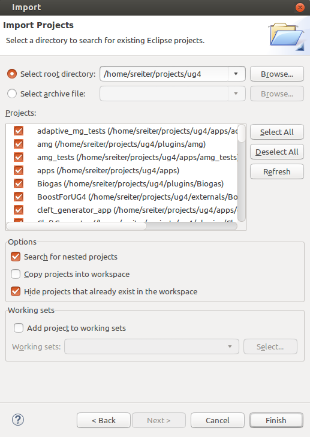

# ughub #

**ughub** - package managment for the [UG4](https://github.com/UG4) simulation environment

Copyright 2015-2018 G-CSC, Goethe-University Frankfurt am Main

*ughub* allows to easily install all the different plugins and applications that
are built on top of [UG4](https://github.com/UG4). It automatically handles inter-package dependencies
and helps in managing the different involved git repositories.

# Contents
This document should give a broad overview on how to obtain and install **ughub** and how to use it to obtain **UG4**.
It also provides a brief introduction on how to build UG4.

* [Installation](#installation)
* [First Steps](#first-steps)
* [Compilation of UG4](#compilation-of-ug4)
* [Importing ug4 into your IDE (optional)](#importing-ug4-into-your-ide-optional)

# Installation
## Prerequisites

### Terminal / Shell
**Mac-OSX** and **Linux** (**Unix**) users should be able to use their default terminal application to execute the commands below.

**Windows** users may use the pre-installed command line tool _**cmd.exe**_. If you're using 'Microsoft Visual Studio' you may instead use the 'VS2015 x64 Command Prompt' (64bit) or the 'VS2013 x86 Command Prompt' (32bit) (or similar). Both can be found in

    'Start -> All Programs -> Visual Studio 2015'.

If you're using Windows, Please replace $HOME with %HOMEPATH% for the remainder of this introduction.

### Python
ughub requires _**Python**_ to run (at least version 2.6 should be available, higher is recommended). Please make sure that python is installed by executing the following command (Mac-OSX, Linux):

    python --version

If you're using Windows, please execute:

    py --version

If it is not yet installed, please do one of the following:

As a Linux user, use your package manager to install it, e.g.:

    sudo apt-get install python

Mac and Windows users can download an installer from <https://www.python.org/downloads/release> (e.g. Python 2.7 or the latest Python 3 installer)

### Git
Please also make sure that _**git**_ is installed on your system and that it can be invoked from your terminal or shell.

### CMake
You will need _**cmake_** to generate the build files for your compiler. On Unix systems you may install cmake using your package manager:

    sudo apt-get install cmake

For Windows and OSX you may download an installer at <https://cmake.org/>.

## Downloading ughub
Please clone the github repository, e.g. by executing the following commands:

    cd $HOME
    git clone https://github.com/UG4/ughub

This will download ughub to _$HOME/ughub_. You may of course clone the repository to any other location. Simply replace _$HOME/ughub_ with your path for the remainder of this introduction.

Please make sure to update your ughub installation from time to time by executing

    cd $HOME/ughub
    git pull

## Installing ughub (Mac-OSX, Linux)
ughub should run out of the box. However, in order to execute it from any path, you should either edit your PATH environment variable by adding the following line to your $HOME/.bash_profile or $HOME/.bashrc file

    export PATH=$PATH:$HOME/ughub

or create a link to $HOME/ughub/ughub from within a path which is already contained in your PATH variable, e.g., like this

    cd $HOME/bin
    ln -s $HOME/ughub/ughub ughub

If you choose to edit your PATH variable, please make sure to reload your .bash_profile or .bashrc files, e.g.:

    source $HOME/.bash_profile

If you are interested in using auto-completion (in bash) while using ughub, add the following additional line to your $HOME/.bash_profile or $HOME/.bashrc file

    source $HOME/ughub/ughub-completion.bash

and reload the file. Alternatively, you can place this line in '~/.bash_completion'.
To use this in zsh, you need to use bashcompinit, see [here](https://stackoverflow.com/a/8492043).
Autocomplete is also availabl for fish. To use this, copy 'ughub-completion.fish' to '~/.config/fish/completions/ughub.fish' (and reload your fish instance).

## Installing ughub (Windows)
ughub should run out of the box on Windows too. However, in order to execute it from any path, you should add

    $HOME/ughub

to your _**Path**_ environment variable (replace $HOME with the actual path). In order to do so, enter

    SystemPropertiesAdvanced

in your shell. This opens the _System Properties_ dialog and highlights the _Advanced_ tab. Click the _Environment Variables_ button at the bottom of the dialog. This opens a dialog which lets you edit the _**Path**_ variable. Note that paths are separated by a semicolon ';'. If the old value of your Path variable was _SomePaths_, the new content should look somewhat like this:

    SomePaths;C:\Users\YOURNAME\ughub

When you're done, press 'OK' to close the dialog. Make sure to restart your Shell in order to apply the changes.

# First steps
ughub serves as a package management tool for the UG4 simulation framework. Use the following command to get some help on ughub's usage:

    ughub help

One typically starts by creating a directory into which all UG4 related packages shall be installed (again, the exact path is arbitrary):

    cd $HOME
    mkdir ug4

Now we can initialize this directory for usage with ughub:

    cd $HOME/ug4
    ughub init

This creates a local CMakeLists.txt file and creates a hidden folder '.ughub' in which package-sources are maintained. All further calls to ughub from within the directory tree located at $HOME/ug4 will now relate to this main directory.  
To view a list of available packages, execute

    ughub list

or 'ughub listpackages'. Which and how many packages are displayed depends on the registered package-sources. To view all registered sources execute

    ughub listsources

To install a package, simply execute 'ughub install' with one or more of the available packages:

    ughub install Examples

Dependent packages will now be automatically installed.

In order to add new package-sources, ughub provides the command 'addsource'. Theoretically, anybody can create new package-sources and host them e.g. on github. UG4's public package-source is hosted at

https://github.com/UG4/ug4-packages

This is ughub's default source and always registered upon execution of 'ughub init'. Feel free to clone it, to add your publicly available packages and to place a merge request.

# Compilation of UG4
For a more detailed introduction to ug4's build settings and to ug4 in general, please also refer to ug4's manual:

http://ug4.github.io/docs

## Prerequisites
### Unix
In order to build UG4, you'll need a C++ compiler (e.g. g++ or clang) and cmake.

### Windows
The Microsoft Visual C++ compiler is recommended for compilation of ug4 on windows. It can be downloaded as part of the free "Express 2015 for Windows Desktop" edition of Visual Studio ([download here](https://www.visualstudio.com/downloads/#visual-studio-express-2015-for-windows-desktop)).

To allow for parallel compilation in the terminal one can optionally use the tool [jom](https://wiki.qt.io/Jom). Extract it and add the path in which the executable lies to your Path environment variable.

## Preparations (Unix)
Before compiling UG4 on Unix, please add the following line to your $HOME/.bashrc or $HOME/.bash_profile file:

    source $HOME/ug4/ugcore/scripts/shell/ugbash

and reload your .bashrc or .bash_profile files, e.g.:

    source $HOME/.bash_profile

This feature is not yet supported for Windows.

## Setting up the build directory
First create a build directory:

    cd $HOME/ug4
    mkdir build
    cd build

On **Unix** simply run cmake:

    cmake -DCMAKE_BUILD_TYPE=Release ..

On **Windows** make sure that you're running the *VS2015 x64 Command Prompt* (or similar).

In order to initialize your build please run

     cmake -G "NMake Makefiles JOM" -DCMAKE_BUILD_TYPE=Release -DSTATIC_BUILD=ON ..
or

    cmake -G "NMake Makefiles" -DCMAKE_BUILD_TYPE=Release -DSTATIC_BUILD=ON ..

depending on whether you installed JOM or not. Alternatively one could also generate Visual Studio Project files. However, this option is not discussed further in this introduction.

Note that static linking should be enabled by default on Windows. If you'd like to build a dynamic library, please have a look at ug4's documentation.

## Configuring your build
Each time you'll execute cmake on your ug4 folder, a list of installed plugins will be shown.
In order to activate an installed plugin, specify the cmake option -DPLUGIN_NAME=ON, e.g.:

    cmake -DConvectionDiffusion=ON .

You may also activate or deactivate all installed plugins at once:

    cmake -DENABLE_ALL_PLUGINS=ON .
    cmake -DDISABLE_ALL_PLUGINS=ON .

Some options speed up compilation considerably. E.g. if you only consider problems in two and three dimensional space and only need scalar matrix coefficients, you may use the following cmake options:

    cmake -DDIM="2;3" -DCPU=1 .

CMake only prepares the build-settings. To actually build UG4 you'll have to execute the build command.

On **Unix** execute, e.g.:

    make -j2

On **Windows** execute, e.g.:

    jom

or

    nmake

depending on which type of generator you used in your first call to cmake.

# Importing ug4 into your IDE (optional)

**Note: If you are using 'Sublime-Text' or similar lightweight editors, simply open the ug4 folder in your editor and save the new project.**

_**ughub**_ features the command '**genprojectfiles**' which automatically generates project-files for a specified target. Currently only the 'eclipse' target is supported. Other targets may follow.

## Eclipse
In order to import ug4's different plugins and applications into Eclipse without breaking its git integration one may use Eclipse's *nested projects*. By calling

    ughub genprojectfiles eclipse

project-files for all apps, plugins, and core-projects are automatically generated or updated. Note that existing project files won't be overwritten unless '--overwrite' is specified (exceptions are ug4/.project, ug4/apps/.project and ug4/plugins/.project). This allows usage of 'genprojectfiles' to generate project-files for newly installed apps and plugins without overwriting changes to existing project-files.  Please follow the steps below to import the generated project files into Eclipse. In order to fully benefit from nested projects, Eclipse Mars (4.5.1) or higher is recommended.

### Initial import / Update
Once the project files have been generated or updated, please execute the following steps in order to import or update your project or newly installed sub-projects in Eclipse (see also images below):
- Open Eclipse,
- Click 'File->Import...->General->Existing Project Into Workspace'
- Choose ug4's root directory, and enable the options 'Search for nested projects'
    and 'Hide projects that already exist in the workspace'. Press 'Finish'.
- From Eclipse MARS on (Eclipse v4.5) you may activate the option
    'Project Presentation->Hierarchical' in the dropdown menu of the 'Project Explorer'.

